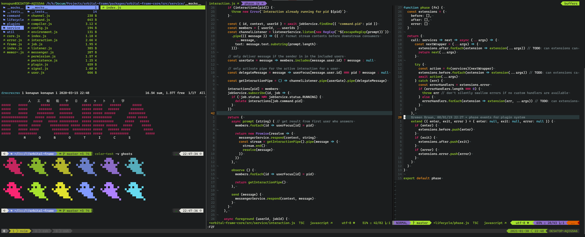

Like many developers, I have a [very specific setup](https://github.com/konapun/dotfiles) which has been evolving over the years. I spend my computing time bouncing between macOS,
Windows 10, and various Linux so one of my goals is to be able to run my custom development environment on all three platforms and to build it with minimal dependencies.


<hr/>

### Selecting a Language
My main requirements for selecting a configuration language were 1) It should be ubiquitous and 2) It should have good interaction with system utilities, which made shell scripting,
in this case zsh, a good fit.

### Theming
Eventually, I wanted to be able to theme my configuration which meant setting points in my config files where new values could be inserted. Since I was already using zsh, I decided
to make a simple theme engine using [sed](https://www.gnu.org/software/sed/manual/sed.html).

#### Implementation in zsh
The simplified version of the code for setting the values and cleaning up unsubstituted variables is below.

```shell
# Apply a value for a variable in a config file
function themer_substitute {
  local key=$1
  local value=$2
  local file=$3

  local pattern="{{$key}}"

  if [[ ! -z $value ]];
    sed -i -- "s&$pattern&$value&g" $file &> /dev/null
  fi
}

# Remove all unreplaced template variables
function themer_cleanup {
  local file=$1

  sed --in-place '/{{.*}}/d' $file &> /dev/null # delete whole line with unsubstituted {{variable}}
}
```

#### Usage in zsh
Variables are inserted into config files by surrounding a key to be replaced with double curlies.
Here is an example from my neovim config file:
```vim
" set theme
set background={{background_color}}
set termguicolors
syntax enable
colorscheme {{syntax_theme}}
```

I then use the themer in my install step to set the values which are sourced from the theme files.
```shell
themer_substitute background_color $BACKGROUND_COLOR $CONFIG_FILE
themer_substitute syntax_theme $SYNTAX_THEME $CONFIG_FILE
themer_cleanup $CONFIG_FILE
```

This works well and fulfills my goals but having to call the function with the key, value, and the config file upon each invocation and needing to call the cleanup function on the
file when finished makes me think this could be done better if zsh supported first class functions.

### A Brief Primer on First Class Functions
A function being "first class" means it can be passed to a function as an argument and also be returned from a function. Even if you haven't used this terminology directly you're
probably used to using them in the form of callbacks. They're also useful for decorating functions with additional functionality.

A closure is a type of first class function where one or more values is "closed over", meaning the function carries its own scope with bound variables.

```js
const makeTimedFunction = fn => async (...args) => {
  const start = Date.now()
  const result = await fn(...args)
  const elapsed = Date.now() - start

  console.log(`Executed in ${elapsed} ms`)
  return result
}

const myFunction = timeout => new Promise(resolve => {
  setTimeout(() => {
    resolve('done')
  }, timeout)
})


const timedFunction = makeTimedFunction(myFunction)

const result = timedFunction(2000).then(() => console.log('done')) // logs "Executed in 2000 ms"
```

### An Implementation Using First Class Functions
So how might I achieve a more succinct API if I were using a more expressive language?

From the motivating example, one of the things I wanted to improve was doing an automatic cleanup after theming - no more having to remember to call `themer_cleanup`. If we have
first class function support then we can wrap the original function with a cleanup step. Using a closure we can avoid having to pass the config file to the function on every call..

#### The engine code
Here is an example of how we could rewrite the themer in a javascript-like languge.

```js
// utils/themer
const cleanup = file => {
  // implementation details left out for brevity
}

export default (path, configFn) => {
  const file = fs.open(path, 'r+')
  const engine = {
    set (key, val) {
      file.replace(`{{${key}}}`, val) // `file.replace` is a hypothetical function used here to illustrate the use of a closure to simplify the client API
    }
  }

  configFn(engine) // run client code

  cleanup(configFile) // remove unsubstituted lines from the configuration
}
```

#### Usage
```js
import theme from '../utils/themer'

theme(env.CONFIG_FILE, engine => {
  engine.set('background_color', env.BACKGROUND_COLOR)
  engine.set('syntax_theme', env.SYNTAX_THEME)
})
```
In this example, the `theme` function initializes the file, gives us a theming API to run in our function, runs our function, and automatically cleans up when our function has
finished executing.

It's not always feasible to choose a language based on expressive power alone but even when it's not, it's still a fun practice to think about how functional techniques can be
used to improve code.
